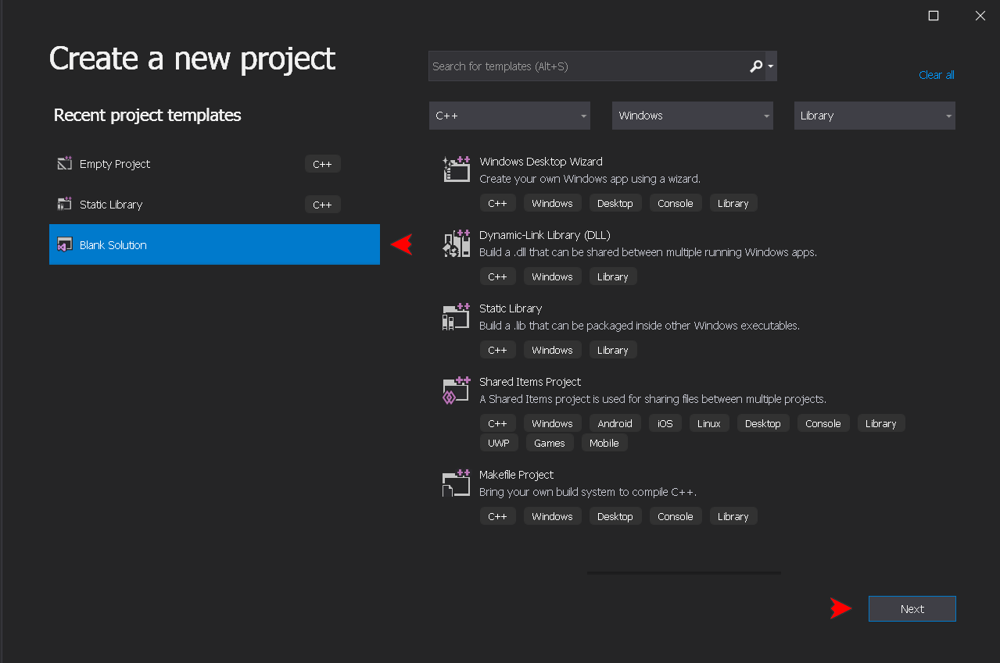
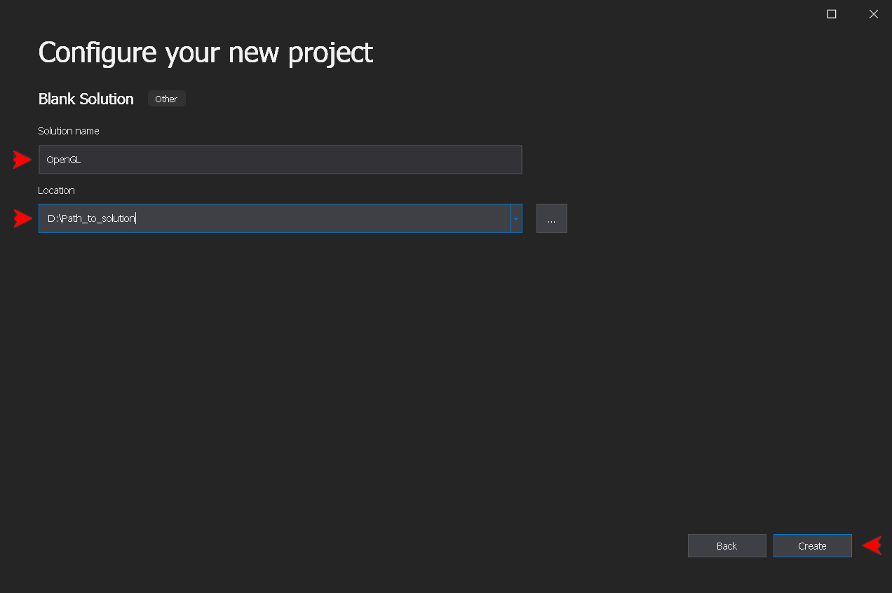
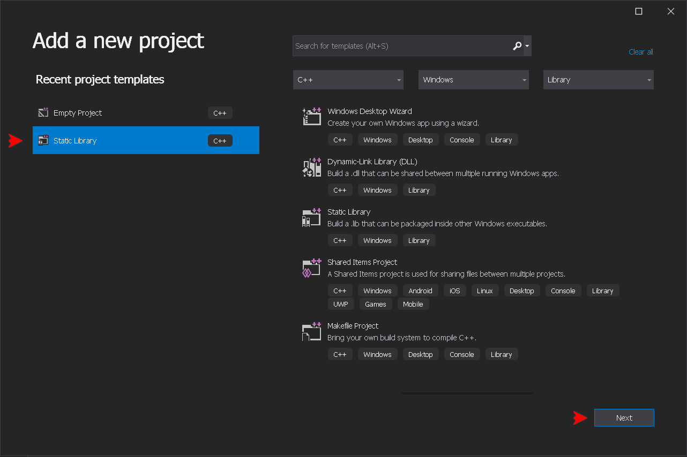
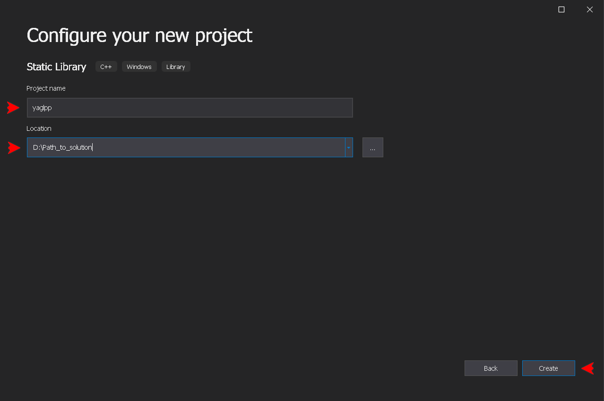
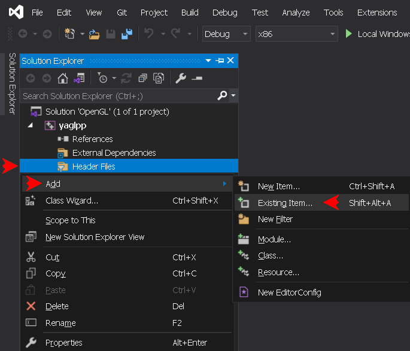
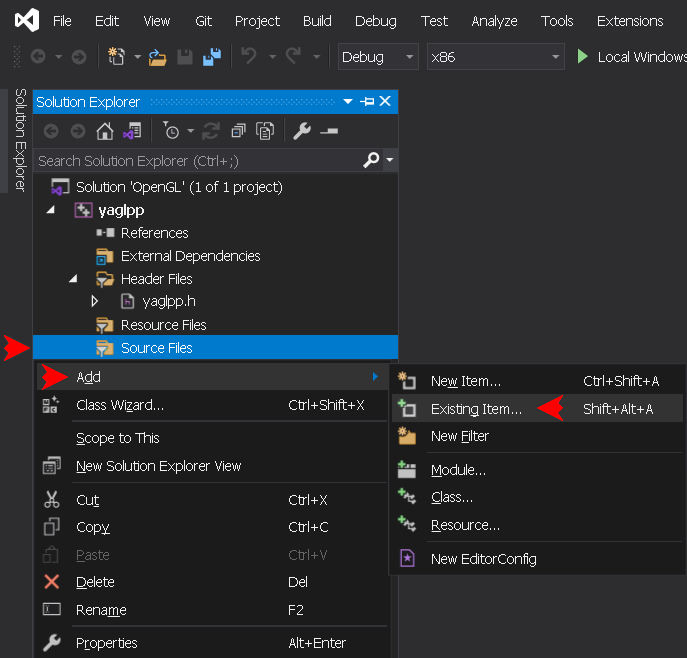
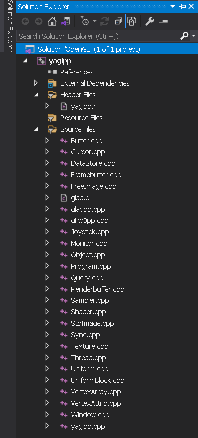
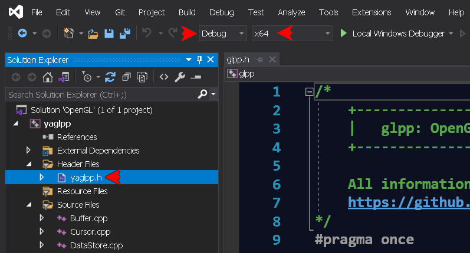

## INSTALLATION
[&nwarr; README](../README.md)<br>
- [1. Download the required OpenGL components from the Internet](INSTALLATION.md#1-download-the-required-opengl-components-from-the-internet)
- [2. Prepare the components's folder](INSTALLATION.md#2-prepare-the-componentss-folder)
- [3. Create a new solution](INSTALLATION.md#3-create-a-new-solution)
- [4. Add the static library project](INSTALLATION.md#4-add-the-static-library-project)
- [5. Add files to the library project](INSTALLATION.md#5-add-files-to-the-library-project)
- [6. Set the library project proprties](INSTALLATION.md#6-set-the-library-project-proprties)
- [7. Build the library](INSTALLATION.md#7-build-the-library)

The installation of YAGL++ library isn't much more complicated than the setup of original OpenGL API components. It actually includes those, while **`#pragma comments`** sets the linking of all required libraries. Once installation is complete, there is no need to set them in project proprieties, just to include the **`yaglpp.h`** in the source file. The library must be built within the application project's solution, it helps understanding the way the library works. The path layout can be different, but it is strongly recommended to use all suggested names and paths (at least for the first time). The offered setup supports **`x64`** and **`Win32`** platforms, producing the console application in Debug mode, and Windows application in Release mode.

> [!TIP]
> For the quick testing, the steps 1 and 2 of the installation process may be skipped, while using the repository **`Common.7z`** archive. In this case, download it on the [repository page](https://github.com/dmitrycello/glpp/tree/main), extract into **`Common`** folder, and if the IDE isn't Visual Studio 2019, make sure to adjust the **`YAGLPP_GLFW_LIB`** switch in [yaglpp.h](../include/yaglpp.h) according to the note in [step 2](INSTALLATION.md#2-prepare-the-componentss-folder). However, it is still recommended to get all components from the Internet, at least for the first time to feel the process. This is also the way the most programmers do, to ensure that each component version is up to date.

### 1. Download the required OpenGL components from the Internet
- [GLAD](https://glad.dav1d.de) archive generated with _Specification_ set to **`OpenGL`**, _Profile_ set to **`Core`**, _API gl_ set to **`Version 3.3`**. Keep _API gles1, gles2, glsc2_ as **`None`**. Do not select any extension!
- [GLFW](https://www.glfw.org/download) archives v3.4 or later from  the 64-bit and 32-bit Windows binaries. Older versions are [here](https://github.com/glfw/glfw/releases).
- [GLM](https://github.com/g-truc/glm) pack v1.0.1 or later.
- [stb_image](https://github.com/nothings/stb/tree/master) library. It is important to use the file versions tested with the current release. Every newer version of a file may require some additional testings. If there is no such version, try using newer version (it usually works), or get the one preserved in **`Common.7z`** archive of this repository. Currently required files are:
	+ **stb_image.h** v2.29
	+ **stb_image_resize2.h** v2.06
	+ **stb_image_write.h** v1.16
- [FreeImage](https://freeimage.sourceforge.io) library 3.18.0 (optional). The only DLL distribution is supported (Win32/x64). The project is not being updated since 2015, so if you decide not to include it, make sure to comment the **`GLPP_FREEIMAGE_LIB`** switch in the **`glpp.h`** file.
- [Latest release](https://github.com/dmitrycello/yaglpp/releases) of YAGL++ library, namely the **`include.7z`** and **`src.7z`** archives. The **`dependencies.txt`** file lists all component's versions tested with current release.

### 2. Prepare the components's folder
Create the new folder anywhere on your PC, and name it **`Common`**. Extract all downloaded components, and move them into the following subdirectories:
```
Common\bin\ <- GLFW and FreeImage 64-bit Dlls
Common\bin\Win32\ <- GLFW and FreeImage 32-bit Dlls
Common\include\glad\glad.h <- header from GLAD archive
Common\include\GLFW\ <- 2 GLFW library headers
Common\include\glm\ <- The <glm> subfolder from the GLM archive
Common\include\KHR\khrplatform.h <- header from GLAD archive
Common\include\stb\ <- 3 stb_image library headers
Common\include\yaglpp\ <- YAGL++ include headers
Common\include\FreeImage.h <- FreeImage header
Common\lib\ <- FreeImage 64-bit Libs
Common\lib\lib-vc2019\ <- GLFW 64-bit Libs
Common\lib\Win32\ <- FreeImage 32-bit Libs
Common\lib\Win32\lib-vc2019\ <- GLFW 32-bit Libs
Common\src\yaglpp\ <- YAGL++ source files
Common\src\glad.c <- Source file from GLAD archive
```

> [!NOTE]
> The GLFW library folder name depends on used IDE. Extract the appropriate folder from the binary archive into the required _lib_ subfolder, then move its dll file into the required _bin_ subfolder. If used IDE is different to Visual Studio 2019, make sure to adjust the folder name from **`lib-vc2019`** to **`lib-vc20xx`** in **`GLPP_GLFW_LIB`** main switch in [yaglpp.h](../include/yaglpp.h) file to link appropriate _lib_ file, where **`xx`** could be: 13, 15, 17, 19 or 22.

### 3. Create a new solution
Create the solution for the library and the main project. On the Visual Studio click **`File -> New -> Project... (Ctrl+Shift+N)`**:


Select **`Blanc Solution`**, hit **`Next`**:



Choose any name and path to solution, e.g. _OpenGL_ on the appropriate drive, hit **`Create`**:



Finally, move the **`Common`** directory created earlier into the solution directory.

### 4. Add the static library project
In the Solution explorer, right-click the solution name bar (1st line). Click **`Add -> New project...`**:


Select **`Static Library (C++)`**, hit **`Next`**:



Type the static library project name, which must be exactly **_yaglpp_**, check the path to the solution, and hit **`Create`**:



### 5. Add files to the library project
In the Solution Explorer remove all header and source files **`(Del)`**. These files no longer needed, so they could be deleted permanently:


Right-click **`Header Files`** filter icon, click **`Add -> Existing Item (Shift+Alt+A)`**. Navigate to **`$(SolutionDir)\Common\include\yaglpp`** directory, select **`yaglpp.h`** file:



> [!NOTE]
> The header files here are irrelevant for the build, and may not be included at all. The **`yaglpp.h`** file is added just to toggle the main switches.

Next, right-click **`Source Files`** filter icon, click **`Add -> Existing Item (Shift+Alt+A)`**. Navigate to **`$(SolutionDir)\Common\src\yaglpp`** directory, and select all **`.cpp`** files:



Finally, add the same way the **`$(SolutionDir)\Common\src\glad.c`** file to **`Source Files`** filter. The Solution Explorer should now look like this:



### 6. Set the library project proprties
Right-click **`yaglpp`** project name bar and press **`Proprties (Alt+Enter)`**:


In the Properties window set **`Configuration`** and **`Platform`** drop-down menus to **`Debug`** and **`x64`**. It is going to be the first platform configuration to set up:


The YAGL++ needs to set 4 configuration options for each platform configuration. To set an option, select a category at the left-hand side, then select an option at the right-hand side. Click the drop-down menu at the right, then hit **`<Edit...>`**, or select the available option:


The YAGL++ library supports 4 platform configurations: **`Debug / x64`**, **`Release / x64`**, **`Debug / Win32`**, **`Release / Win32`**. Here is the list of the required options under each of the 4 platform configurations in form **_category -> name: value_**:

- **`Debug / x64 (LIB)`**:
```
General -> Output Directory: $(SolutionDir)\Common\lib\Debug\
VC++ Directories -> Include Directories: $(SolutionDir)\Common\include\;$(IncludePath
VC++ Directories -> Library Directories: $(SolutionDir)\Common\lib\;$(LibraryPath)
C/C++ -> Precompiled Headers -> Precompiled Header: 'Not Using Precompiled Headers'
```
- **`Release / x64 (LIB)`**:
```
General -> Output Directory: $(SolutionDir)\Common\lib\
VC++ Directories -> Include Directories: $(SolutionDir)\Common\include\;$(IncludePath)
VC++ Directories -> Library Directories: $(SolutionDir)\Common\lib\;$(LibraryPath)
C/C++ -> Precompiled Headers -> Precompiled Header: 'Not Using Precompiled Headers'
```
- **`Debug / Win32 (LIB)`**:
```
General -> Output Directory: $(SolutionDir)\Common\lib\Win32\Debug\
VC++ Directories -> Include Directories: $(SolutionDir)\Common\include\;$(IncludePath)
VC++ Directories -> Library Directories: $(SolutionDir)\Common\lib\Win32\;$(LibraryPath)
C/C++ -> Precompiled Headers -> Precompiled Header: 'Not Using Precompiled Headers'
```
- **`Release / Win32 (LIB)`**:
```
General -> Output Directory: $(SolutionDir)\Common\lib\Win32\
VC++ Directories -> Include Directories: $(SolutionDir)\Common\include\;$(IncludePath)
VC++ Directories -> Library Directories: $(SolutionDir)\Common\lib\Win32\;$(LibraryPath)
C/C++ -> Precompiled Headers -> Precompiled Header: 'Not Using Precompiled Headers'
```

> [!IMPORTANT]
> Some platform configurations may be never used. But it is recommended to set them all now, to avoid the mess later.

> [!WARNING]
> Make sure to hit the **`Apply`** button after setting up each platform configuration.

### 7. Build the library
Now close the Properties window. In the Solution Explorer open **`yaglpp.h`** file, so the IDE focuses on yaglpp project within the solution. Select any of the 4 platform configuration on the top of IDE:



Click **`Build -> Rebuild yaglpp`**:


The output should look like this:
```
Rebuild started...
1>------ Rebuild All started: Project: yaglpp, Configuration: Debug x64 ------
1>glad.c
1>Buffer.cpp
1>Cursor.cpp
1>DataStore.cpp
1>Framebuffer.cpp
1>FreeImage.cpp
1>gladpp.cpp
1>gladpp.cpp: Compiling with GLAD version 3.3 support...
1>glfw3pp.cpp
1>glfw3pp.cpp: Compiling with GLFW version 3.4 nonlegacy support...
1>Joystick.cpp
1>Monitor.cpp
1>Object.cpp
1>Program.cpp
1>Query.cpp
1>Renderbuffer.cpp
1>Sampler.cpp
1>Shader.cpp
1>StbImage.cpp
1>Sync.cpp
1>Texture.cpp
1>Thread.cpp
1>Uniform.cpp
1>Generating Code...
1>Compiling...
1>UniformBlock.cpp
1>VertexArray.cpp
1>VertexAttrib.cpp
1>Window.cpp
1>yaglpp.cpp
1>Generating Code...
1>yaglpp.vcxproj -> D:\Path_to_solution\OpenGL\Common\lib\Debug\yaglpp.lib
========== Rebuild All: 1 succeeded, 0 failed, 0 skipped ==========
```
> [!NOTE]
> Rebuild ensures to process the every source file from scratch. Use **`Build yaglpp (Ctrl+B)`** to update the build.

The library supports OpenGL versions 2.0 to 3.3. To downgrade the default version (3.3), you must generate a new GLAD archive, rename its **`glad.h`** file to **`gladXX.h`** and move it into **`glad`** directory, do not use other files from the downgraded archives. The XX is the number of GLAD version: 20, 21, 30, 31, 32 for versions 2.0 to 3.2. The context version control could be great for backward compatible coding.

> [!IMPORTANT]
> Generating all 5 downgraded GLAD versions allows to quickly set the OpenGL context version by changing the **`GLPP_CONTEXT_VERSION_MAJOR`** and **`GLPP_CONTEXT_VERSION_MINOR`** switches. Just set the desired value, and rebuild the library. But to learn OpenGL, always stick to default version 3.3!

By default, YAGL++ uses _dll_ version of GLFW library. It is much easier to use pre-compiled _lib_ files of GLFW, rather than build them from sratch. But when using Static GLFW build, while Debugging, if you by some accident Step Into the function, you will get an unpleasant screen '.pdb not found', it is because the _lib_ file does not have the right path of the source file. While using _dll_ version, the function is simply stepped out. When compiling the final version of your project, you may switch to the Static GLFW build by setting the **`GLPP_GLFW_LIB`** switch to **`glfw3.lib`** or **`glfw3_mt.lib`**. Note that using dlls decreases the application file size, and saves the computer RAM while running several applications using that dll, but the appropriate dll must be distributed with the application.

> [!TIP]
> After installation is complete, the original API assets will be still available, so it is possible to combine C++ and C programming in the same source, but the only interaction of C code with the YAGL++ objects is limited.

[&uarr; TOP](INSTALLATION.md#installation) [USAGE &rarr;](docs/USAGE.md)
