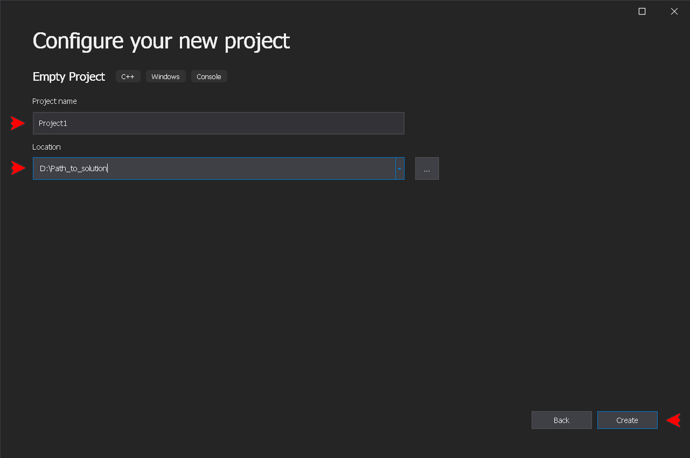

## USAGE
[&nwarr; README](../README.md)<br>
- [1. Add the application project](USAGE.md#1-add-the-application-project)
- [2. Set the application project properties](USAGE.md#2-set-the-application-project-properties)
- [3. Add the source file to the application project](USAGE.md#3-add-the-source-file-to-the-application-project)
- [4. Type the code](USAGE.md#4-type-the-code)

The described earlier library installation setup requires the OpenGL application project to be added to the same solution. It is possible to create mutiple projects under the same solution, so the reinstallation of the library in not required.

### 1. Add the application project
To add the application project to the solution, use the same way as for the static library: in the _Solution Explorer_ right-click the solution name bar (1st line), Click **`Add -> New project...`**:


Select **`Empty Project (C++)`**, press **`Next`**:


Choose any project name, check the path to the solution, and hit **`Create`**:



In the _Solution Explorer_, right-click the project's name and click **`Set as Startup Project`**, to set default running output application:


### 2. Set the application project properties
Right-click application project name bar and press **`Proprties (Alt+Enter)`**. In the Properties window set Configuration and Platform to Debug / x64:


In the Properties window set **`Configuration`** and **`Platform`** drop-down menus to **`Debug`** and **`x64`**. It is going to be the first platform configuration to set up:


As the library project, the application project may be used in one of the 4 platform configurations. In order to change the application platform configuration, it is necessary to build the library under that configuration. The application Debug platform configuration requires to set 4 configuration options, the application Release platform configuration requires an extra option to set the [entry point](https://learn.microsoft.com/en-us/cpp/build/reference/entry-entry-point-symbol).

- **`Debug / x64 (EXE)`**:
```
Debugging -> Environment: path=%path%;$(SolutionDir)\Common\bin\
VC++ Directories -> Include Directories: $(SolutionDir)\Common\include\;$(IncludePath)
VC++ Directories -> Library Directories: $(SolutionDir)\Common\lib\;$(LibraryPath)
Linker -> System -> SubSystem: 'Console (/SUBSYSTEM:CONSOLE)'
```
- **`Release / x64 (EXE)`**:
```
Debugging -> Environment: path=%path%;$(SolutionDir)\Common\bin\
VC++ Directories -> Include Directories: $(SolutionDir)\Common\include\;$(IncludePath)
VC++ Directories -> Library Directories: $(SolutionDir)\Common\lib\;$(LibraryPath)
Linker -> System -> SubSystem: 'Windows (/SUBSYSTEM:WINDOWS)'
Linker -> Advanced -> Entry Point: mainCRTStartup
```
- **`Debug / Win32 (EXE)`**:
```
Debugging -> Environment: path=%path%;$(SolutionDir)\Common\bin\Win32\
VC++ Directories -> Include Directories: $(SolutionDir)\Common\include\;$(IncludePath)
VC++ Directories -> Library Directories: $(SolutionDir)\Common\lib\;$(LibraryPath)
Linker -> System -> SubSystem: 'Console (/SUBSYSTEM:CONSOLE)'
```
- **`Release / Win32 (EXE)`**:
```
Debugging -> Environment: path=%path%;$(SolutionDir)\Common\bin\Win32\
VC++ Directories -> Include Directories: $(SolutionDir)\Common\include\;$(IncludePath)
VC++ Directories -> Library Directories: $(SolutionDir)\Common\lib\;$(LibraryPath)
Linker -> System -> SubSystem: 'Windows (/SUBSYSTEM:WINDOWS)'
Linker -> Advanced -> Entry Point: mainCRTStartup
```

> [!WARNING]
> Make sure to hit the **`Apply`** button after setting up each platform configuration.

### 3. Add the source file to the application project
In the _Solution Explorer_, right-click the project's Source Files filter icon. Click **`Add -> New Item... (Ctrl+Shift+A)`**:


Select **`C++ File (.cpp)`**, type any name, check the path, and hit **`Add`**


### 4. Type the code
In the editor window type the minimal YAGL++ application code:
```
// Source.cpp
#include <yaglpp/yaglpp.h>
int main(int argc, char** argv)
{
	glfw::Window glWindow(800, 600, "LearnOpenGL");
	glWindow.makeContextCurrent();
	while (!glWindow.windowShouldClose())
	{
		gl::clearColor(0.2f, 0.3f, 0.3f, 1.0f);
		gl::clear(gl::BufferBitMask::ColorBufferBit);
		glWindow.swapBuffers();
		glfw::pollEvents();
	}
	return 0;
}
```
The IntelliSense shows the description of every library member:


The build output should look like this:
```
Rebuild started...
1>------ Rebuild All started: Project: Project1, Configuration: Debug x64 ------
1>Source.cpp
1>Project1.vcxproj -> D:\Path_to_solution\OpenGL\x64\Debug\Project1.exe
========== Rebuild All: 1 succeeded, 0 failed, 0 skipped ==========
```
Now hit **`F5`** to run the application:


To overload window events, use the new window class derived from **`glfw::Window`**:
```
// Source.cpp
#include <yaglpp/yaglpp.h>
class LearnOpenGL : public glfw::Window
{
	using Window::Window;                     // Base constructors
	void onFramebuffer(int width, int height) // Framebuffer callback
	{
		gl::viewport(0, 0, width, height);
	}
};
int main(int argc, char** argv)
{
	LearnOpenGL glWindow(800, 600, "LearnOpenGL");
	//...
```
Lastly, the example of the library usage in AFX-alike layout. The application class must be derived from **`glfw::Thread`** or **`glfw::ThreadWnd`** class:
```
// Source.cpp
#include <yaglpp/yaglpp.h>
class GLApplication : public glfw::ThreadWnd
{
	void onInitThread()   // Create window
	{
		m_pWindow = new glfw::Window(800, 600, "LearnOpenGL");
		m_pWindow->makeContextCurrent(this);
	}
	void onRenderWindow() // Rendering loop
	{
		gl::clearColor(0.2f, 0.3f, 0.3f, 1.0f);
		gl::clear(gl::BufferBitMask::ColorBufferBit);
	}
};
GLApplication glApplication;
```

> [!WARNING]
> In order to use AFX-alike layout, comment the **`GLPP_NO_AFX_LAYOUT`** switch in the [yaglpp.h](../include/yaglpp.h) library header, and rebuild YAGL++.

> [!NOTE]
> AFX-alike layout is rather experimental, and at the moment has only two classes. But it could become very promising direction for development in the future.

[&uarr; TOP](USAGE.md#usage)
